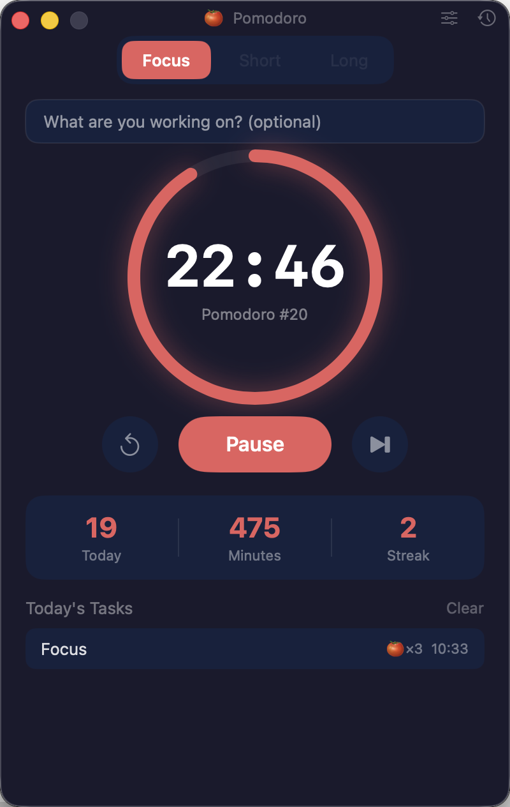
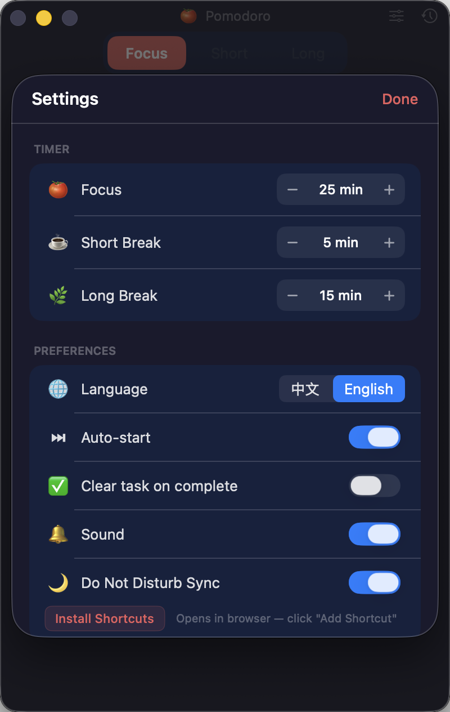
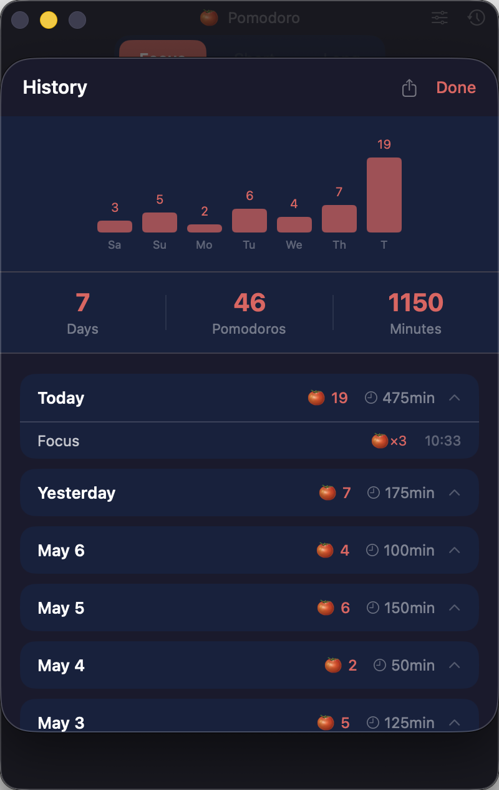

# 🍅 Pomodoro

A minimal macOS Pomodoro timer built with Swift + SwiftUI.

 

## Features

- **25 / 5 / 15 min** work and break cycles (fully customizable)
- **Menu bar** — live countdown always visible, control without opening the main window
- **Task tracking** — label what you're working on; autocompletes from recent tasks
- **Do Not Disturb sync** — automatically enables DND when a focus session starts, disables it on break; respects pre-existing DND state
- **Auto-start** — optionally start the next session automatically after each transition
- **Accurate timer** — computed from wall-clock time, immune to system load and display sleep
- **Session continuity** — the 4-session break cycle (3 short → 1 long) persists across app restarts
- **Daily stats** — today's pomodoros, focus minutes, and streak days
- **History view** — 7-day bar chart + past sessions grouped by day
- **CSV export** — export all session data from the History view
- **System notifications + sound** on session complete
- **Runs in background** — closing the window keeps the timer going; click the Dock icon to bring it back
- **English / 中文** — language switcher in Settings

## Screenshots

<div align="center">
  
  &nbsp;&nbsp;
  
  &nbsp;&nbsp;
  
</div>

## Build & Run

Requires Xcode Command Line Tools (`xcode-select --install`).

```bash
git clone https://github.com/goshinoo/PomodoroApp.git
cd PomodoroApp
bash build_and_run.sh
```

This builds a release binary, installs it to `/Applications/Pomodoro.app`, and launches it.

## Package as DMG

```bash
bash make_dmg.sh
```

Produces `Pomodoro-1.3.dmg` with an ad-hoc signature. Recipients may need to right-click → Open the first time to bypass Gatekeeper.

## Do Not Disturb Setup

Enable **Do Not Disturb Sync** in Settings, then click **Install Shortcuts** to install the required Shortcut in one click. The app will automatically enable DND when a focus session starts and disable it when a break begins. If DND was already active before the session, the app leaves it untouched.

## Project Structure

```
Sources/PomodoroApp/
├── PomodoroApp.swift      # App entry point, menu bar extra
├── TimerViewModel.swift   # Timer logic, persistence, stats, DND integration
├── ContentView.swift      # Main window UI
├── MenuBarContent.swift   # Menu bar popover
├── HistoryView.swift      # Multi-day history sheet
├── SettingsView.swift     # Settings sheet
└── Theme.swift            # Shared Color constants
```

## Tech

- SwiftUI + AppKit on macOS 13+
- `UserDefaults` for per-day persistence
- `NSSound` + `UNUserNotificationCenter` for audio and system notifications
- `/usr/bin/shortcuts` CLI for Do Not Disturb integration
- Swift Package Manager (no dependencies)
